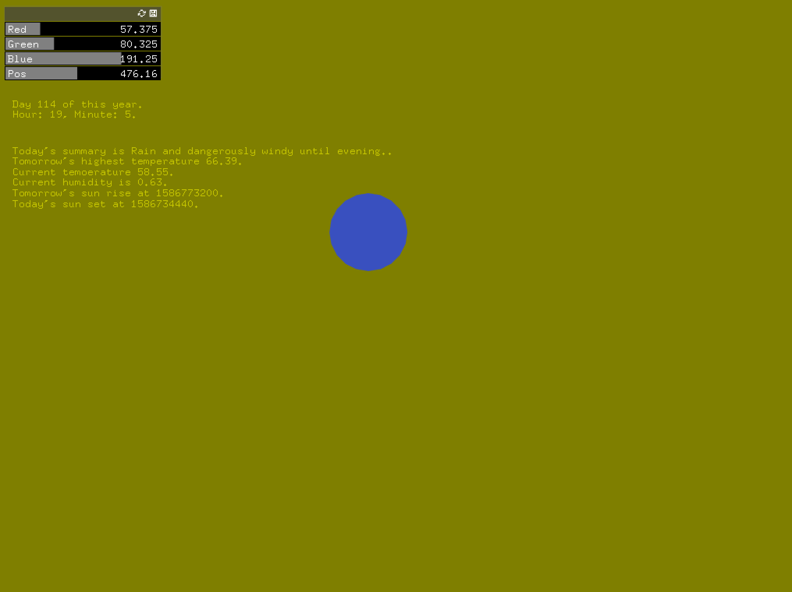

# Assignment_8

#### Element used:
##### Current temp  - as Circle's Red
##### Tomorrow's higest temp  - as Circle's Green 
##### Current humidity  - as Circle's Blue 
##### Todays sunset  
##### Tomorrow's sunrise
##### No.# of day  - as Circle's PosX

#### link to video

