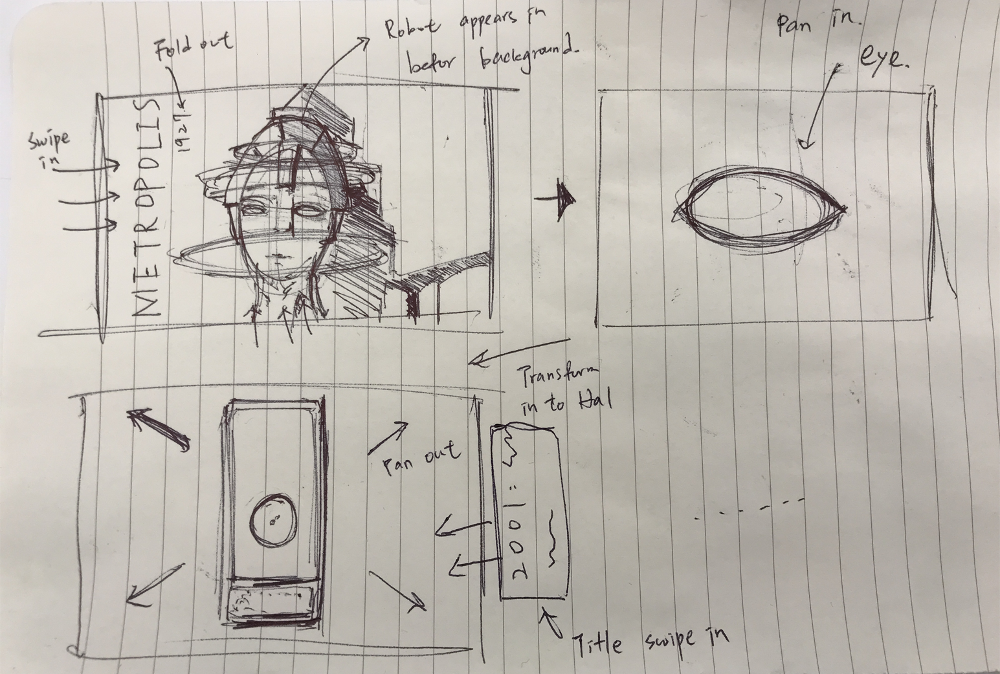
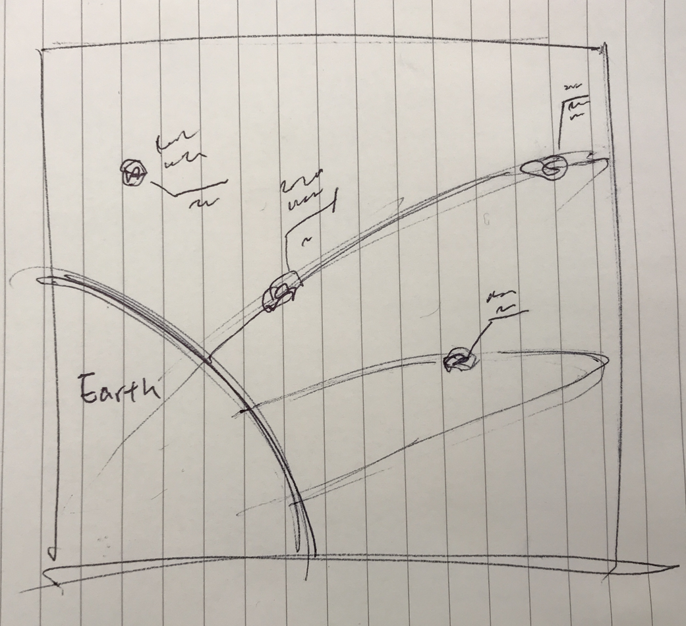
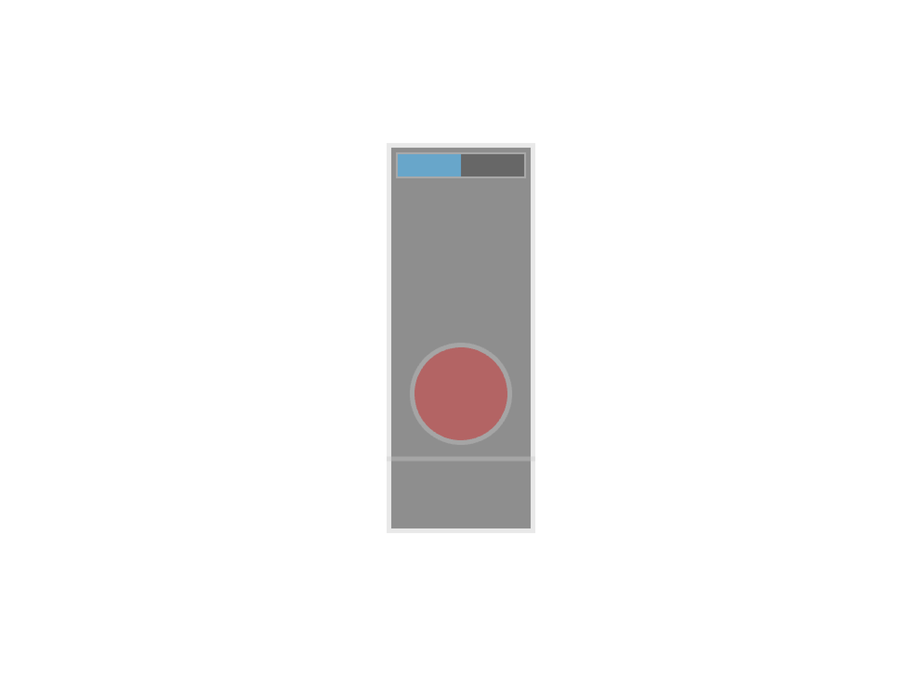
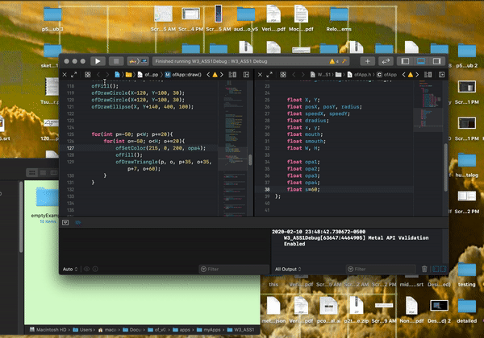

# Project_1
## A brief history of Artificial Intelligence in movies.
#### User : General Public
#### Platform/Form : 2D Motion Graphic

#### Narrative:
From Metropolis to Her, a 5 minute ish video about various A.I.s/ Robots portrayed in popular movies and how they shaped our perception on intelligence today.

#### Visual:
Recreating scenes from the selected movies with minimalist styles using basic geometric shapes, linking the transition with outline of the protagonist through transformation.

# Project_2
## Asteroids - NeoWs
#### User : General Public

#### Context:
NeoWs (Near Earth Object Web Service) is a RESTful web service for near earth Asteroid information. With NeoWs a user can: search for Asteroids based on their closest approach date to Earth, lookup a specific Asteroid with its NASA JPL small body id, as well as browse the overall data-set.

Data-set: All the data is from the NASA JPL Asteroid team (http://neo.jpl.nasa.gov/).

#### Experience:
Simple graphic indicating newr earch orbiting objects, with attatched attributes like Radious, Dates....etc) 

#### Potential obstacles:
The file structure contains only single astroid, with different files linkings to different astroids, I am not sure how complicated incorporating multiple api in of would be or if its even possible. 

#### Inspriation: [[OpenFrameworks] Data Visualization with ofxJSON](https://vimeo.com/110925630)

# Project_3
## Conway's Game of Life
#### User : General Public
#### Context : Consist of numerous cells (in a grid system) which contain one of the each states : Alive or Dead, each of them interact with their 8 neighbors.
Every cell must abide by the following rules :
1. Any live cell with two or three neighbors survives.
2. Any dead cell with three live neighbors becomes a live cell.
3. All other live cells die in the next generation. Similarly, all other dead cells stay dead.

Its a game without human interaction, influenced by it's initial status.

# OF Elements
Click on Hal to see the demo video  ↴  ↴  ↴  ↴  ↴

