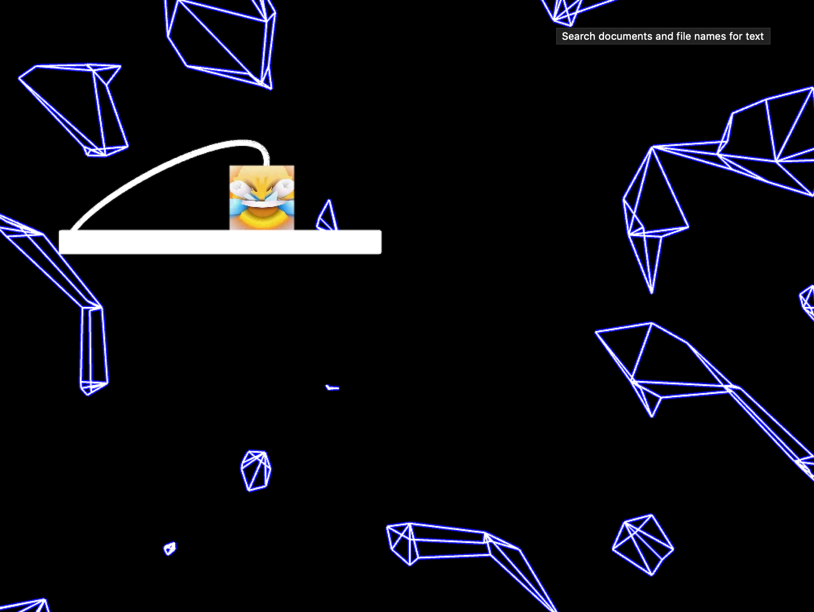
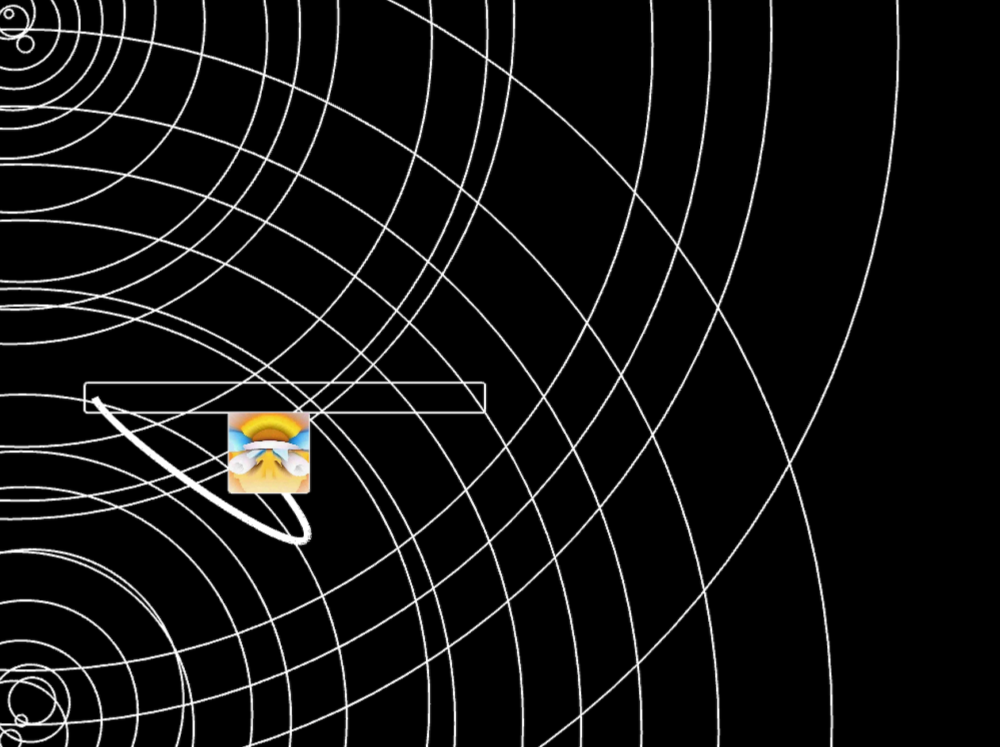

# P1 Extension cord connecting scene

### Inspiration:

I wonder what's gonna happen when I plug an extension socket into itself.
[Additional reference](https://www.youtube.com/watch?v=nz3lNLybeDo)

### Concept: 

Recursive paradox that ultimately breaks time and space. (I  hope)
Drastically altering the background when the plug makes contact with the socket.
On and off audio in relation to the socket status.

**:/ Translation**

3 Background scenes in total, with different patterns (mesh, noise, for-loop)
Shuffling the scenes with ofGetFrameNum() and operator to different sections of time frames. 
Cord done with Bezier curves with noise embeded in it's anchor points (Probably need to find a better input than system timmer, to make the movement feels more natural)
Socket and plug moves with ofNoise.

**Further down the road**

There's still a lot of parameters to be tinker with all three backgrounds, especially the mesh one, an obvious path might be setting the tempo and wave height in relation to the audio playing, creating a more consistent environment. ie. Changing the camera angle/distance with different itterations. Creating a counter on how much time those 2 objects had made contact and translate it onto the parameters.

Incorporateing shaders to create a better sence of depth.

**Possible interaction**

Potential to take audio/cam/kinect video as input to control the two objects, possibliy becomming a more engaging experience.

**:/ An anxiety inducing video.**

The main idea is just to visualize and speculate a dumb thing we all might wonder from time to time, the idea of breaking something so trivial yet so integral.

**:/ Process notes.**

Visually requires numerous fine-tunes.
Technically still trying to figuring out the infinite forloop pattern (Orange dots), currently using a very labor intensive way (Preloading 10000*10000 ish objects)

**:/ Reflection.**

Soft on narrative, feels repetitive wayyyy sooner than expected.
Not really with a optimal user in mind.

**Link to Youtube video:**

