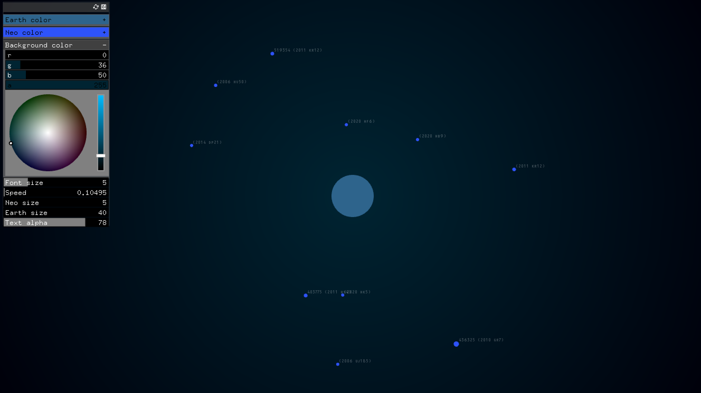
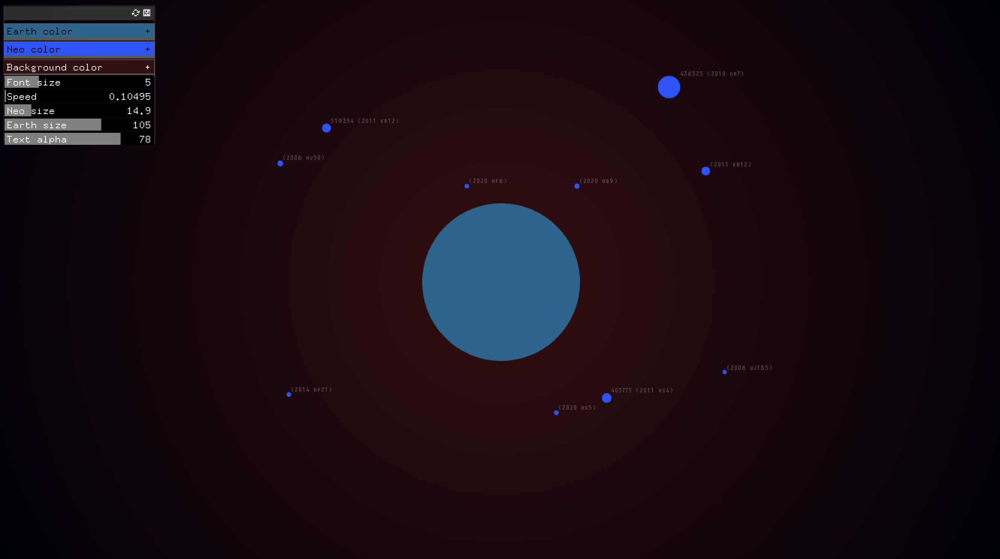
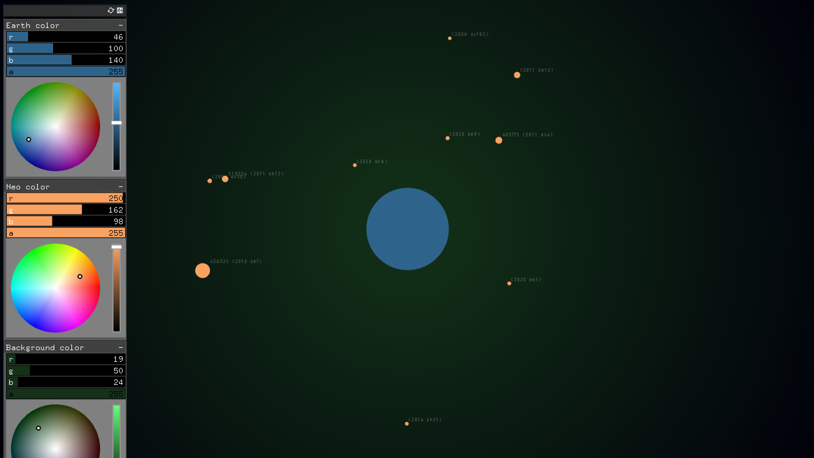

# Project_2 

#### API source: [NASA Asteroids - NeoWs](https://api.nasa.gov/)

NeoWs (Near Earth Object Web Service) is a RESTful web service for near earth Asteroid information. With NeoWs a user can: search for Asteroids based on their closest approach date to Earth, lookup a specific Asteroid with its NASA JPL small body id, as well as browse the overall data-set.

Data-set: All the data is from the NASA JPL Asteroid team (http://neo.jpl.nasa.gov/).

#### Translation:

Due the nature of the API call (including a set time frame), this project serves as a visualization of the 9 highlighted NEO on 4,23,2020. Size were accurate within the context of all the NEOs except Earth itself (the difference were too drastic if I made the size of NEOs 1:1 to Earth), distance were also being manipulated to achieve a better visual. 

- Estimated (Minimal Diameter + Maximum Diameter) / 2   ►   Neo (Near Earth Object) diameter.
- Closest Missed Distance in meters   ►   Neo orbit diameter.
- Relative velocity in kps   ►   Orbital speed.
- Name

#### Sliders:

- Text size
- Text alpha
- Neo(+text) speed
- Neo size
- Neo color
- Earth size
- Earth color
- Background color

Link to video below  ↴

